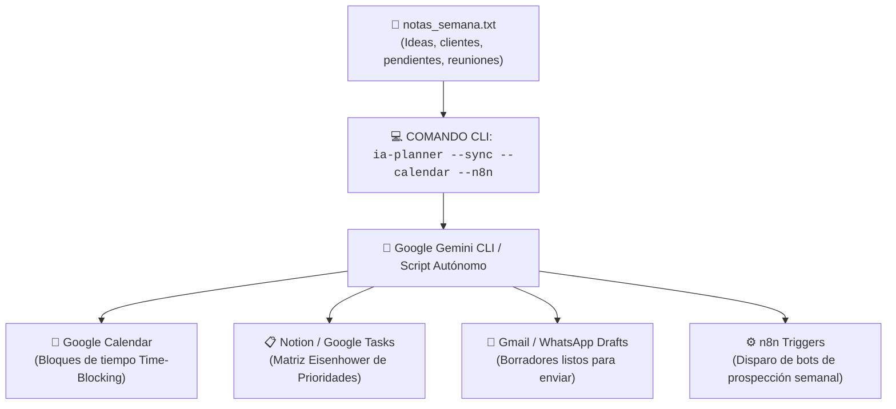

# ⚡ MASTERCLASS PRÁCTICA: "ORGANIZA TODA TU SEMANA EN 15 MINUTOS CON LA CLI"
> **Herramientas:** Terminal / PowerShell / Bash + Gemini CLI / Antigravity + Google Workspace / Notion / n8n Webhooks  
> **Objetivo:** Ejecutar toda la planeación semanal, agendamiento de citas, priorización de tareas y disparo de agentes en lote con 1 solo comando de terminal *de jalón*.

---

## 🎯 ¿DE QUÉ TRATA ESTA LECCIÓN? (EL SUPERPODER DE LA TERMINAL)

La mayoría de la gente pierde de 2 a 4 horas cada lunes abriendo 10 pestañas del navegador, pasando tareas a mano, revisando correos viejos y acomodando bloques de Google Calendar.

En esta clase enseñamos el **"Método de Jalón en 15 Minutos"**:
1. Escribes tus objetivos y notas sueltas en un solo archivo de texto o nota rápida.
2. Corres un comando en la **CLI (Command Line Interface / Terminal)**.
3. El Agente de IA analiza prioridades, crea los eventos en Google Calendar, genera las tareas en Notion/Todoist, redacta los correos pendientes y enciende los flujos de n8n **en menos de 10 segundos**.

---

## 🛠️ ARQUITECTURA DEL COMANDO MAESTRO



---

## 💻 EL SCRIPT DE EJECUCIÓN (LISTO PARA USAR)

### 1. El archivo de entrada (`notas_semana.txt`):
```text
- Reunión con cliente despacho jurídico el martes a las 11 AM para ver propuesta de $2,000 USD.
- Grabar 2 reels de n8n el miércoles a las 4 PM.
- Pagar nómina/servidores el viernes a las 10 AM.
- Prospectar 20 agencias en LinkedIn entre lunes y miércoles.
- Revisar avances de la Cohorte 1 el jueves 7:30 PM.
```

### 2. El comando en la Terminal:
```bash
# Ejecución con 1 solo comando asistido por Gemini
python automation_engine/weekly_organizer_cli.py --input notas_semana.txt --sync
```

### 3. Lo que sucede en pantalla en 10 segundos:
```text
[✓] Analizando contexto con Google Gemini 2.5...
[✓] 5 Eventos sincronizados en Google Calendar con recordatorios automáticos.
[✓] Matriz de tareas de Notion actualizada en estado 'Por Hacer'.
[✓] Flujo n8n de prospección semanal activado en segundo plano.
[✓] ¡Semana 100% organizada en 12 segundos! A trabajar 🚀
```

---

## 🎓 CÓMO ENSEÑAR ESTO EN CLASE (EL EFECTO "WOW"):

1. **Minuto 1:** Pides a un alumno del público que te dicte en el chat 5 pendientes desordenados de su semana.
2. **Minuto 5:** Los pegas en la terminal y ejecutas el comando en vivo.
3. **Minuto 7:** Abres tu Google Calendar y tu Notion en pantalla compartida y todos ven cómo apareció su semana perfectamente calendarizada con bloques de colores y recordatorios.
4. **Minuto 15:** Les entregas el script `.py` y el comando para que lo instalen en su máquina con 1 clic.
