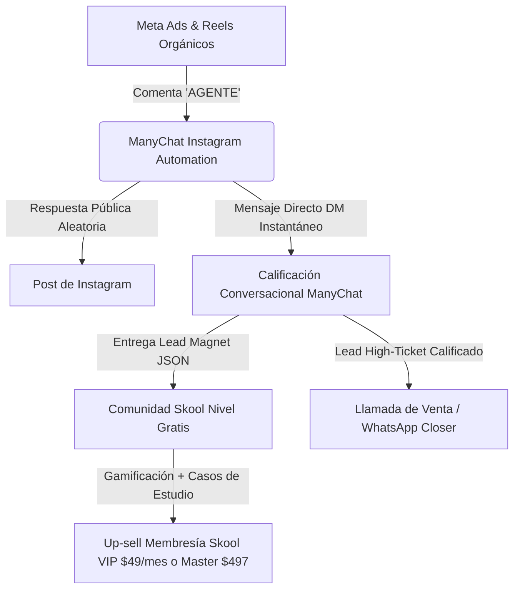

# 🏛️ HISTÓRICO DE ARQUITECTURA DE PAGO: MANYCHAT + SKOOL + META ADS
> **Documento de Preservación de Arquitectura Comercial y Operativa**  
> **Estado:** *Archivado para Reactivación en Fase de Escala Comercial (Fase 2)*  
> **Proyecto:** Academia de IA y Automatización (AAA) / Laboratorio Asistente IA  
> **Costo Base del Stack:** ~$150 - $1,500+ USD/mes (Software + Pauta)

---

## 📋 1. RESUMEN EJECUTIVO Y PROPÓSITO DEL DOCUMENTO

Este documento preserva en su totalidad el diseño, configuraciones técnicas, árboles de decisión, copys de anuncios y economía unitaria de la **Arquitectura de Pago Original** basada en la combinación de **ManyChat (Instagram Automation)**, **Skool ($99 USD/mes)** y **Meta Ads**.

El objetivo de este archivo es garantizar que, una vez validada la comunidad orgánica en el stack gratuito ($0) y alcanzados los hitos de tracción necesarios, el equipo pueda reactivar e implementar esta infraestructura de pago en menos de 48 horas sin perder tiempo en reingeniería.



---

## 🤖 2. ARQUITECTURA TÉCNICA DE MANYCHAT (COMMENT-TO-DM)

La automatización de ManyChat está diseñada para operar sobre cuentas de Instagram Professional/Creator mediante la API oficial de Meta.

### 2.1. Disparadores y Palabras Clave (Triggers)
* **Palabra Clave Principal:** `AGENTE`
* **Palabras Clave Secundarias:** `PLANTILLA`, `JSON`, `N8N`, `AUTOMATIZAR`
* **Ámbito de Aplicación:** Todos los Reels, Publicaciones en el Feed y Anuncios de Meta Ads.

### 2.2. Algoritmo Anti-Shadowban (Respuestas Públicas Dinámicas)
Meta penaliza cuentas que responden exactamente el mismo texto a decenas de comentarios idénticos. ManyChat debe rotar aleatoriamente entre al menos 5 variantes:
1. `¡Te acabo de enviar la plantilla por mensaje directo! 🚀 Revisa tu buzón.`
2. `¡Listo! Checa tus DMs para descargarlo 📩`
3. `Te mandé el acceso y el video al privado 🔥`
4. `¡Revisa tu bandeja de entrada! Acabo de enviarte todo 🤖`
5. `¡Enviado! Mira tus mensajes directos para importar el JSON ⚡`

### 2.3. Árbol de Conversación y Ramificación de DMs

```text
[DISPARADOR: Comentario con palabra 'AGENTE']
│
├── 1. PUBLIC COMMENT REPLY (Aleatorio 1 de 5)
│
└── 2. INSTAGRAM DIRECT MESSAGE (Inmediato < 5 seg)
    │
    ├── Mensaje 1:
    │   "¡Hola {{first_name}}! 👋 Aquí tienes el acceso directo para descargar
    │    la plantilla JSON del Agente Autónomo y el video tutorial paso a paso:
    │    
    │    👉 [ENLACE_DE_ACCESO_SKOOL]
    │    
    │    PD: Dentro de la comunidad tienes más de 10 plantillas listas para importar.
    │    ¿Ya tienes instalado n8n o estás empezando desde cero?"
    │
    ├── Quick Replies (Botones de Respuesta Rápida):
    │   🔘 [Ya tengo n8n instalado]
    │   🔘 [Empiezo desde cero]
    │
    ├── RAMA A: [Ya tengo n8n instalado]
    │   ├── Tag asignado: `perfil_tecnico_intermedio`
    │   └── Mensaje:
    │       "¡Brutal! Entonces te va a volar la cabeza el módulo de Multi-Agent Swarms.
    │        ¿Estás usando n8n para automatizar tu propio negocio o quieres ofrecer
    │        servicios de automatización a clientes B2B?"
    │       ├── 🔘 [Para mi propio negocio] -> Tag: `lead_b2b_dueño`
    │       └── 🔘 [Servicios para clientes] -> Tag: `lead_agencia_interesado`
    │
    └── RAMA B: [Empiezo desde cero]
        ├── Tag asignado: `perfil_principiante`
        └── Mensaje:
            "¡Excelente momento para empezar! En la comunidad dejé una guía de 10 minutos
            para montar tu servidor propio por $5/mes sin saber programar.
            ¿Te gustaría que te avise cuando hagamos la próxima sesión en vivo de preguntas y respuestas?"
            ├── 🔘 [¡Sí, avísame!] -> Solicitar Email / WhatsApp -> Custom Field: `phone_number`
            └── 🔘 [Solo quiero el JSON] -> Tag: `consumidor_recurso_gratis`
```

### 2.4. Matriz de Etiquetas (Tags) y Custom Fields

| Nombre de Etiqueta | Condición de Activación | Acción Posterior |
| :--- | :--- | :--- |
| `lead_agencia_interesado` | Selecciona "Servicios para clientes" | Enviar secuencia de emails sobre cómo cobrar $1,500-$3,000 por flujo. |
| `lead_b2b_dueño` | Selecciona "Para mi propio negocio" | Ofrecer auditoría de procesos 1-a-1 gratuita (Filtro para High-Ticket). |
| `perfil_principiante` | Selecciona "Empiezo desde cero" | Enviar tutorial de instalación de n8n en VPS Hetzner. |
| `high_ticket_qualified` | Facturación reportada > $5k/mes o presupuesto > $1,500 | Notificar vía webhook a Slack/WhatsApp del closer en tiempo real. |

---

## 🏫 3. ARQUITECTURA DE LA COMUNIDAD EN SKOOL ($99 USD/MES)

Skool actúa como el centro de retención, formación y entrega de valor. Su costo fijo es de **$99 USD/mes** por grupo.

### 3.1. Estructura de Pestañas y Contenidos

#### 1. Pestaña "Classroom" (Ruta de Aprendizaje):
* **Nivel 1 - Gratuito / Público (Onboarding & Quick Win):**
  * *Bienvenida y Reglas de la Comunidad* (Video de 3 min por el fundador).
  * *Setup de n8n en VPS propio en 10 minutos* (Hetzner + Docker + SSL).
  * *Bóveda de 5 Plantillas Gratuitas:*
    * JSON 1: Agente SDR de WhatsApp BANT.
    * JSON 2: Scraper de Google Maps con extracción de emails.
    * JSON 3: Resumen automático de llamadas con transcripción Whisper.
    * JSON 4: Generador de contenido para redes sociales multi-formato.
    * JSON 5: Clasificador inteligente de correos en Gmail.
  * *Roadmap: De 0 a tus primeros $1,000 USD con IA*.
* **Nivel 2 - VIP / Alumnos del Máster (Acceso Bloqueado por Membresía):**
  * *Máster Completo en Agentes Autónomos (40+ horas)*.
  * *Librería de 50+ JSONs Avanzados con Multi-Agentes*.
  * *Vault Comercial:* Modelos de contratos, propuestas en Figma/Canva, plantillas de cold email B2B y calculadoras de ROI para clientes.
  * *Grabaciones de Sesiones de Consultoría y Debugging en Vivo*.

#### 3.2. Pestaña "Community" y Gamificación (Niveles 1 a 9)
La gamificación en Skool incentiva a los usuarios a aportar valor para desbloquear recursos:
* **Nivel 1 (0 puntos):** Acceso a las 5 plantillas básicas y canal de presentación.
* **Nivel 2 (5 puntos):** Desbloquea plantilla de *Agente Scraper de LinkedIn*.
* **Nivel 3 (20 puntos):** Desbloquea masterclass *Cómo cobrar tu primer Setup Fee de $1,500*.
* **Nivel 4 (65 puntos):** Desbloquea acceso al canal privado de alianzas y subcontratación.
* **Nivel 7+ (500+ puntos):** Invitación a sesión privada mensual con el equipo fundador.

#### Canales de Discusión en Skool:
* `#victorias:` Obligatorio publicar cuando un alumno cierra un cliente o implementa un agente con éxito. Genera FOMO y prueba social interna.
* `#dudas-tecnicas:` Canal de soporte colaborativo y resolución de errores de n8n.
* `#networking-y-alianzas:` Para que programadores se asocien con perfiles comerciales.
* `#recursos-y-prompts:` Compartir descubrimientos y actualizaciones del ecosistema.

#### 3.3. Pestaña "Calendar" (Eventos Semanales Recurrentes)
* **Martes 18:00 UTC:** *Live Build & Debugging* (Construcción de agentes paso a paso y resolución de errores de alumnos en directo).
* **Jueves 18:00 UTC:** *Clínica de Ventas y Prospección B2B* (Revisión de propuestas, llamadas en frío simuladas y feedback comercial).

---

## 📢 4. ESTRATEGIA DE PAUTA PUBLICITARIA EN META ADS

### 4.1. Estructura de Campañas (Funnel de Conversión)

```mermaid
graph LR
    subgraph TOFU ["Top of Funnel (TOFU)"]
        Ad1["Reel: Agente cierra $1800 mientras duermes"]
        Ad2["Reel: Deja de aprender Python"]
        Ad3["Reel: Reemplacé 3 herramientas con 1 JSON"]
    end

    subgraph MOFU ["Middle of Funnel (MOFU)"]
        DM["Conversación ManyChat Instagram"]
        SkoolFree["Skool Gratis: 5 Plantillas + Quickstart"]
    end

    subgraph BOFU ["Bottom of Funnel (BOFU)"]
        Retargeting["Retargeting a VSL / Oferta Máster"]
        Call["Llamada de Admisión High-Ticket"]
    end

    TOFU -->|Comentario 'AGENTE'| MOFU
    MOFU -->|Calificación & Engagement| BOFU
```



### 4.2. Presupuestos y Benchmarks de Rendimiento

| Fase de Campaña | Presupuesto Recomendado | Métrica Clave (KPI) | Benchmark Objetivo |
| :--- | :--- | :--- | :--- |
| **Testeo de Creativos (ABO)** | $15 - $30 USD / día (3 a 5 ad sets) | CTR Único en el enlace / CTR saliente | > 1.80% |
| **Escala de Mensajes (CBO)** | $50 - $150 USD / día | Costo por Comentario / Inicio de DM | $0.35 - $0.75 USD |
| **Generación de Miembros Skool** | $50 - $100 USD / día | Costo por Miembro Skool Aprobado | $1.20 - $2.50 USD |
| **Retargeting a VSL / Programa** | $20 - $40 USD / día | Costo por Aplicación / Llamada Agendada | < $25.00 USD |

---

## 💰 5. ECONOMÍA UNITARIA (UNIT ECONOMICS) DEL STACK DE PAGO

### 5.1. Costos Operativos Mensuales (OPEX)

| Concepto | Proveedor / Servicio | Costo Mensual Estimado |
| :--- | :--- | :--- |
| **Comunidad y Cursos** | Skool Community Platform | $99.00 USD |
| **Automatización de DMs** | ManyChat Pro (según volumen de contactos) | $15.00 - $65.00 USD |
| **Servidor VPS n8n** | Hetzner Cloud (CX22 / CPX31) | $5.50 - $15.00 USD |
| **Consumo de APIs (LLMs)** | Anthropic (Claude 3.5) + OpenAI (GPT-4o) | $30.00 - $100.00 USD |
| **Pauta Publicitaria** | Meta Ads (Fase Inicial de Validación) | $450.00 - $900.00 USD ($15-$30/día) |
| **Total Mensual Inicial:** | | **~$600 - $1,180 USD/mes** |

### 5.2. Modelo de Ingresos y Punto de Equilibrio (Break-Even)
Para cubrir el OPEX de ~$1,000 USD/mes con la arquitectura de pago:
* **Vía Membresía Skool VIP ($49/mes):** Requiere **21 alumnos activos** para break-even.
* **Vía Máster / Bootcamp ($497 USD único):** Requiere **2 ventas al mes** para break-even.
* **Vía Servicio de Implementación B2B / High-Ticket ($2,000 USD):** Requiere **1 cliente cada 2 meses** para break-even y alta rentabilidad.

---

## 🚀 6. PROTOCOLO DE REACTIVACIÓN Y MIGRACIÓN (CUÁNDO Y CÓMO ESCALAR)

### 6.1. Criterios de Activación (Triggers de Decisión)
Reactivar este stack de pago **únicamente** cuando se cumplan al menos 2 de las siguientes 3 condiciones:
1. **Comunidad Gratuita (Telegram + Discord):** Superar los **500 miembros activos** con alta interacción orgánica diaria.
2. **Validación de Oferta:** Haber cerrado un mínimo de **$3,000 USD en ventas orgánicas** (mediante servicios, consultorías o preventas).
3. **Flujo de Caja Disponible:** Contar con un presupuesto reservado de marketing de al menos **$1,500 USD** para cubrir 3 meses de herramientas y pauta publicitaria.

### 6.2. Checklist Paso a Paso de Reactivación (48 Horas)
1. **Día 1 - Configuración de Infraestructura:**
   * Crear cuenta y grupo en Skool ($99/mes) importando la estructura de carpetas definida en la Sección 3.
   * Conectar ManyChat Pro a la cuenta de Instagram @de_la_academia y vincular página de Facebook.
   * Cargar el flujo `AGENTE` en ManyChat y configurar los randomizadores de respuesta.
2. **Día 2 - Lanzamiento de Pauta y Sincronización:**
   * Subir las 3 creativos ganadores validados orgánicamente a Meta Ads Manager.
   * Configurar campaña de interacción optimizada para "Comentarios en publicaciones".
   * Configurar Webhook de ManyChat a n8n para registrar todos los leads generados en Google Sheets / CRM.
   * Iniciar con presupuesto de $20 USD/día y monitorear CPL cada 12 horas.

---

*Documento archivado y verificado. Listo para reactivación comercial.*
