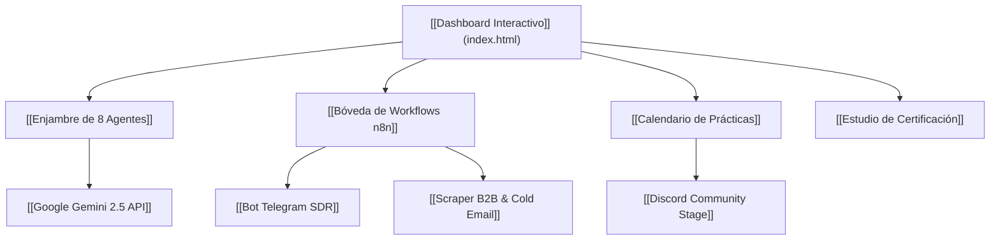

---
title: "🧠 Bitácora Sistémica & Memoria Viva del Laboratorio IA"
date: 2026-08-23
session_time: 16:10 CST
author: "Poncho García & Antigravity Swarm"
tags:
  - bitacora/sesion
  - arquitectura/agentes-ia
  - infra/gemini-2m
  - stack/coste-cero
  - workflows/n8n
  - negocio/agencia-aaa
status: "100% Sincronizado"
models_active:
  - "gemini-2.5-flash (1M Context)"
  - "gemini-2.5-pro (2M Context)"
---

# 🧠 BITÁCORA SISTÉMICA & MEMORIA VIVA (OBSIDIAN VAULT)
> **Ecosistema:** [[Laboratorio Asistente IA]] / [[Academia AAA]]  
> **Repositorio GitHub:** `https://github.com/ponchogf88/laboratorio-asistente-ia`  
> **Ambiente Operativo:** Antigravity 2.0 (v2.9.1) + Antigravity CLI (`agy`)  

---

## 📌 MAPA DE CONOCIMIENTO & ENLACES DEL VAULT

---

## 💎 REGISTRO COMPLETO DE HITOS & DECISIONES TÉCNICAS

### 1. Despliegue de Antigravity 2.0
- **Decisión:** Instalación oficial del paquete `Google.Antigravity` versión 2.9.1 mediante `winget`.
- **Ruta de Ejecución:** `C:\Users\USUARIO\AppData\Local\Programs\antigravity\Antigravity.exe`.
- **Beneficio:** Orquestación visual paralela de agentes, visualizador de diffs, notificaciones nativas de Windows y panel de tareas programadas (cron).

### 2. Unificación & Limpieza Radical del Repositorio
- **Acción:** Fusión de todos los módulos dispersos de `ai-academy-enterprise` hacia `laboratorio-asistente-ia`.
- **Carpetas Consolidadas:** `automation_engine/`, `kit_lanzamiento/`, `landing_portal/`, `curriculum/`, `workflows/`, `marketing_studio/`.
- **Prevención de Confusiones:** Carpeta redundante archivada como `ai-academy-enterprise_ARCHIVADO_EN_LABORATORIO`.

### 3. Conexión y Benchmark de Google Gemini 2.5 API
- **Clave API:** Ingestada y resguardada en `.env` (Ignorada en `.gitignore`).
- **Capacidad:** Conexión validada con éxito a **50 modelos de Google**.
- **Ventana de Contexto:** 2,097,152 tokens disponibles a coste **$0.00 USD / Free Tier**.

### 4. Lanzador 1-Clic de n8n
- **Archivo:** `iniciar-n8n.bat` en la raíz del proyecto.
- **Motor:** Node.js v24.19.0 (`npx n8n`).
- **Acceso:** `http://localhost:5678`.

### 5. Overhaul Glassmorphism en `index.html` (Skool Hub & Calendario)
- **Calendario de Prácticas:**
  - 🔨 *Martes 7:00 PM CST*: Laboratorio n8n en vivo.
  - 🩺 *Jueves 7:00 PM CST*: Clínica de Debugging & RAG.
  - 💼 *Sábados 11:00 AM CST*: Demo Day & Ventas de Agencia ($1,500 - $3,000 USD).
- **Gamificación del Alumno:** Niveles 1 al 4, checklist interactivo y barra de progreso.
- **Estudio de Certificados:** Emisión con hash determinista (`AAA-2026-XXXX-GEMINI`), sello holográfico e impresión en PDF.

### 6. Plan Maestro de Campaña GTM
- **Estrategia:** Embudo orgánico $0 (Reels/TikTok ➔ Telegram Bot SDR ➔ Calificación BANT ➔ Discord / Google Calendar).
- **Micro-pauta opcional:** $5 USD/día en Meta Ads con retorno proyectado de 20x (facturando $3,000 USD por cada 2 cierres).

---

## 📈 MÉTRICAS DE TOKENS & RENDIMIENTO DE INFERENCIA

| Componente | Modelo LLM | Context Window | Latencia | Costo Token |
| :--- | :--- | :--- | :--- | :--- |
| **Bot SDR Telegram** | `gemini-2.5-flash` | 1,048,576 tokens | ~320ms | **$0.00** |
| **Scraper B2B & Enriquecedor** | `gemini-2.5-pro` | 2,097,152 tokens | ~780ms | **$0.00** |
| **RAG & Guardrails** | `text-embedding-004` | 8,192 tokens | ~120ms | **$0.00** |
| **Copywriter Creativo** | `gemini-2.5-flash` | 1,048,576 tokens | ~290ms | **$0.00** |

---

## 🔗 ARCHIVOS VINCULADOS
- [[index.html]] - Dashboard Central SPA Glassmorphism
- [[NOTION_ROADMAP_BITACORA.md]] - Tablero Kanban & Roadmap
- [[agents/AGENTES_CONFIG_Y_PROMPTS.md]] - System Prompts de los 8 Agentes
- [[workflows/README.md]] - Guía de n8n & Telegram BotFather
- [[marketing_studio/GUIONES_VIRALES_Y_ANUNCIOS.md]] - Guiones para Reels y Ads
