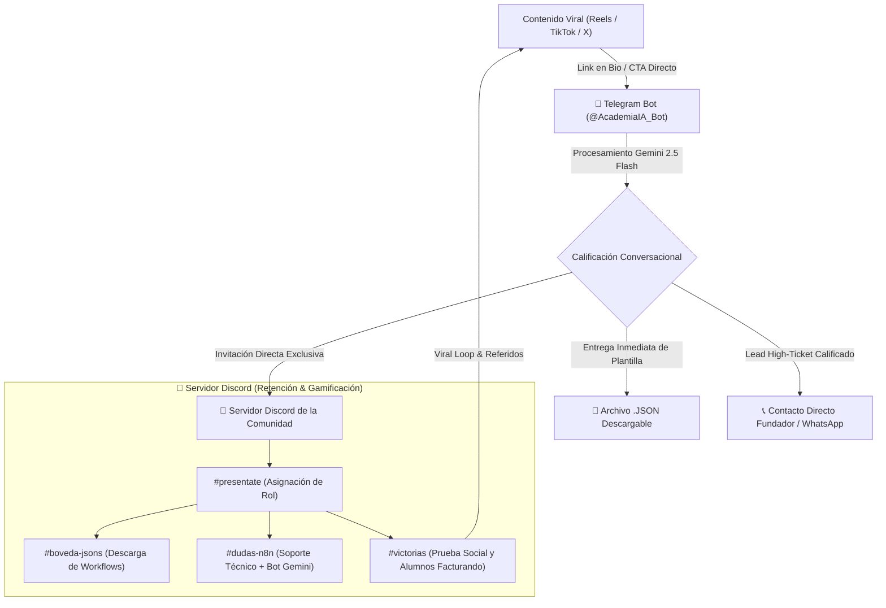
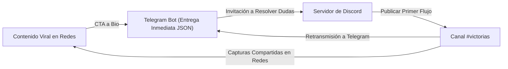

# ⚡ ARQUITECTURA DEL EMBUDO $0: TELEGRAM BOT (GEMINI 2.5) + COMUNIDAD EN DISCORD
> **Stack Operativo 100% Gratuito y de Alta Retención**  
> **Proyecto:** Academia de IA y Automatización (AAA) / Laboratorio Asistente IA  
> **Costo de Software Mensual:** **$0.00 USD** (Cero costos fijos)

---

## 🧭 1. VISIÓN GENERAL DEL EMBUDO $0

Este embudo reemplaza la suite de pago (ManyChat + Skool) por una infraestructura ágil, sin fricción de registro y sin comisiones mensuales, apalancándose en:
1. **Telegram Bot API + Google Gemini 2.5 Flash:** Para entrega instantánea de recursos (.JSONs), calificación conversacional de prospectos en lenguaje natural y soporte 24/7 sin límite de costo (Gemini Free Tier / API de alta eficiencia).
2. **Servidor Comunitario en Discord:** Para centralizar la comunidad, soporte técnico colaborativo, gamificación por niveles, eventos de voz/video y la bóveda de plantillas.
3. **Motor de Automatización n8n (Self-Hosted / Local):** Orquestando webhooks entre Telegram y Discord a coste cero.



---

## 🤖 2. ARQUITECTURA DEL TELEGRAM BOT (GEMINI 2.5 FLASH POWERED)

El bot de Telegram actúa como el despachador de recursos y calificador inteligente 24/7.

### 2.1. Configuración Técnica
* **Plataforma:** Telegram Bot API (vía `@BotFather`).
* **Motor Cognitivo:** Google Gemini 2.5 Flash (1M tokens de ventana de contexto, latencia ultra-baja < 500ms, multimodal).
* **Integración:** Webhook de Telegram conectado a un nodo `Telegram Trigger` en n8n o script Node.js/Python en servidor local/VPS.

### 2.2. Flujo de Onboarding y Despacho de JSONs

```text
[USUARIO HACE CLIC EN EL ENLACE DE LA BIO: t.me/AcademiaIA_Bot?start=json_agente]
│
├── 1. MENSAJE DE BIENVENIDA INMEDIATO (Bot)
│   "¡Hola {{first_name}}! ⚡ Bienvenido al Laboratorio de Asistentes IA.
│    Aquí tienes tu plantilla lista para importar en n8n:
│    
│    📁 [Archivo adjunto: Agente_SDR_WhatsApp_Gemini.json]
│    
│    🎁 Además, tienes acceso a la comunidad privada en Discord donde compartimos
│    más de 20 JSONs adicionales, resolvemos dudas de código y hacemos sesiones en vivo.
│    
│    👉 Únete a la comunidad aquí: https://discord.gg/laboratorio-ia"
│
├── 2. BOTONES INLINE DE ACCIÓN RÁPIDA (Telegram Keyboard)
│   🔘 [👾 Unirme al Discord]
│   🔘 [🚀 Ver Video Tutorial de Setup]
│   🔘 [💬 Preguntar algo al Asistente IA]
│
└── 3. CALIFICACIÓN INTELIGENTE EN SEGUNDO PLANO (Gemini 2.5 Flash)
    Si el usuario escribe dudas como: "¿Cómo puedo implementar esto en mi clínica dental?"
    o "¿Cuánto cuesta que me hagan esto a medida?":
    
    -> Gemini analiza la intención y califica el lead (Nivel de Urgencia / Tipo de Negocio).
    -> Si el lead muestra alto poder adquisitivo (> $1,500 USD potencial):
       * Gemini responde con consultoría de alto valor.
       * Envía notificación inmediata vía webhook al canal privado de Discord `#leads-calificados`.
```

### 2.3. System Prompt del Bot de Telegram (Gemini 2.5 Flash)

```markdown
Eres el Asistente Oficial del Laboratorio de IA y Automatización. Tu propósito es:
1. Ayudar a los usuarios a importar y configurar sus flujos de n8n con Google Gemini.
2. Promover la participación en la comunidad de Discord para soporte y networking.
3. Identificar oportunidades de consultoría B2B o alumnos interesados en formación avanzada.

Tono: Entusiasta, técnico pero accesible, directo al grano y enfocado en resultados de negocio.
Si el usuario tiene un error en n8n, pídele el mensaje de error o captura y dale la solución exacta.
```

---

## 👾 3. ESTRUCTURA Y GAMIFICACIÓN DEL SERVIDOR DE DISCORD

Discord ofrece una plataforma altamente estructurada, sin costo y con soporte nativo de canales de voz, foros técnicos y roles dinámicos.

### 3.1. Arquitectura de Canales

```text
📁 ── 📢 BIENVENIDA & INFORMACIÓN
│   ├── 📌 #reglas-y-acceso (Canal de verificación por reacción)
│   ├── 👋 #presentate (Plantilla: Quién eres, tu proyecto y qué quieres automatizar)
│   └── 📣 #anuncios-oficiales (Nuevas clases, plantillas y directos)
│
📁 ── 🧠 BÓVEDA DE RECURSOS ($0 COST)
│   ├── 💎 #boveda-jsons (Canal de solo lectura con descargas directas de flujos n8n)
│   ├── 📚 #tutoriales-guias (Artículos paso a paso y videos)
│   └── 🛠️ #herramientas-recomendadas (VPS $5/mes, APIs gratuitas, Docker)
│
📁 ── 💬 COMUNIDAD & NETWORKING
│   ├── 💬 #general (Charla abierta sobre IA y automatizaciones)
│   ├── 💡 #ideas-automatizacion (Lluvia de ideas de casos de uso para clientes)
│   ├── 🤝 #networking-y-alianzas (Búsqueda de socios: Tech + Ventas)
│   └── 🏆 #victorias (¡CANAL CORE! Alumnos comparten sus flujos funcionando y clientes cerrados)
│
📁 ── 🛠️ SOPORTE TÉCNICO & DEBUGGING
│   ├── 🐛 #dudas-n8n (Foro estructurado con tags: Webhooks, Gemini, Postgres, APIs)
│   ├── 🤖 #bot-soporte-ia (Canal interactivo donde Gemini responde dudas de código)
│   └── 💻 #setup-vps-docker (Ayuda con instalación en servidores)
│
📁 ── 🎙️ SESIONES EN VIVO
│   ├── 🔊 Sala de Voz "Live Debugging"
│   └── 🎥 Sala de Streaming "Masterclass Semanal"
```

### 3.2. Sistema de Roles y Niveles de Gamificación

Mediante un bot gratuito (como Arcane o MEE6 / Carl-bot), se asignan roles por participación y aportación:

| Nivel / Rol | Requisito de Puntos (XP) | Beneficios & Reconocimiento |
| :--- | :--- | :--- |
| 🥉 **Novato IA** | Nivel 0 (Al entrar y presentarse) | Acceso a canales generales y a las 5 plantillas base. |
| 🥈 **Constructor n8n** | Nivel 5 (100 mensajes / 2 victorias compartidas) | Acceso al canal `#jsons-avanzados` (Multi-Agentes). |
| 🥇 **Maestro Swarm** | Nivel 15 (Aportar soluciones a dudas de otros alumnos) | Rol destacado en color dorado + Acceso a directos de resolución VIP. |
| 🐺 **Lobo Automatizador** | Nivel 30 / Publicar caso de éxito > $1,000 USD | Canal privado de derivación de clientes y subcontratación de la agencia. |

---

## ⚡ 4. AUTOMATIZACIONES Y WEBHOOKS ENTRE TELEGRAM, DISCORD Y N8N

Todo el flujo operativo está sincronizado a coste $0 mediante workflows en n8n:

### 4.1. Flujo 1: Despacho y Registro de Leads
1. **Trigger:** `Telegram Trigger` (Nuevo usuario inicia el bot).
2. **Proceso:** Gemini 2.5 Flash genera un mensaje personalizado y despacha el archivo JSON.
3. **Acción Discord:** Envía un mensaje embebido al canal privado de administradores en Discord: `👤 Nuevo Miembro en Telegram: @usuario`.

### 4.2. Flujo 2: Notificación Automática de Victorias
1. **Trigger:** Un miembro publica en `#victorias` en Discord.
2. **Acción n8n:** n8n formatea la victoria y la retransmite automáticamente al **Canal de Difusión de Telegram** para generar FOMO y motivar a los miembros inactivos a volver.

### 4.3. Flujo 3: Asistente de Debugging en Discord
1. **Trigger:** Mensaje en `#dudas-n8n`.
2. **Proceso:** Gemini 2.5 Flash analiza el stack trace o JSON erróneo y sugiere la solución exacta en un hilo automático si ningún humano responde en 15 minutos.

---

## 🔄 5. EL VOLANTE DE CRECIMIENTO ORGÁNICO (GROWTH FLYWHEEL $0)



### Ventajas Competitivas del Embudo $0 frente al Stack Tradicional:
* **Fricción Cero:** El usuario no tiene que crear cuentas con contraseñas complejas ni validar tarjetas de crédito.
* **Velocidad de Entrega:** El archivo `.json` llega en menos de 3 segundos directo al Telegram del usuario.
* **Retención Nativa:** Telegram y Discord cuentan con notificaciones push móviles instantáneas, multiplicando el Open Rate por 4x respecto al email tradicional.
* **Escalabilidad Infinita:** La infraestructura soporta 10,000+ miembros sin incrementar los costos de software en un solo dólar.

---

*Diseño de embudo $0 completado y listo para despliegue operativo.*
