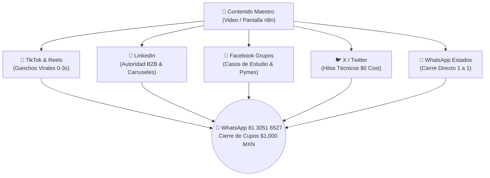

# 🚀 PLAN DE ASALTO OMNICANAL 360°: TIKTOK, INSTAGRAM, LINKEDIN, FACEBOOK & X
> **Proyecto:** Laboratorio Crea tu Asistente Personal IA (Cohorte 1)  
> **Instructor:** Lic. Alfonso García / GC2 Legal Solutions  
> **Llamado a la Acción:** "Iniciamos este Domingo 6:00 PM • Solo 15 Cupos Fundadores ($1,000 MXN) • WhatsApp: 81 3051 6527"

---

## 🗺️ MAPA DE DISTRIBUCIÓN POR PLATAFORMA



---

## 🎵 1. TIKTOK & INSTAGRAM REELS (VIDEOS VERTICALES DE 30-45 SEG)

### 🎬 REEL 1: "La pantalla que trabaja mientras duermes"
* **Formato:** Video vertical. Primeros 3 segundos tu cara hablando a cámara con energía; luego pantalla de tu computadora mostrando n8n ejecutándose y nodos iluminándose en verde.
* **Texto en Pantalla (Hook):** *"Mi agente de IA acaba de calificar y agendar un cliente a las 3:14 AM 🤯"*
* **Audio del Guion:**
> "Acaban de dar las 3 de la mañana y este agente de IA con Google Gemini acaba de calificar un prospecto con criterio BANT y agendarlo directo en mi Google Calendar mientras duermo.
> 
> Y lo mejor de todo: no pagué suscripciones de $300 dólares en Zapier ni Make. Todo corre en mi propio servidor con ejecuciones ilimitadas y la API de Gemini a coste cero.
> 
> Este próximo **Domingo a las 6:00 PM** arranco un grupo piloto de 15 personas para enseñarte a construir este agente en vivo paso a paso.
> 
> Comenta **'AGENTE'** o mándame mensaje a mi WhatsApp en el link del perfil y te aparto tu lugar antes de que se llenen los 15 cupos."
* **Copy del Post (Pie de foto):**
```text
Automatiza tu atención comercial sin pagar suscripciones mensuales de software ⚡🤖

Este próximo Domingo de 6:00 PM a 7:30 PM abrimos la Cohorte 1 del "Laboratorio: Crea tu Asistente Personal IA" impartido por GC2 Legal Solutions.

📌 Te llevas: Tus 4 Agentes en n8n listos para importar + Constancia Privada con Validez.
⚡ Precio Fundador: $1,000 MXN (Solo 15 plazas).

👉 Mándame WhatsApp al 81 3051 6527 o comenta "AGENTE" para enviarte la tarjeta de acceso.

#n8n #ia #inteligenciaartificial #automatizacion #agentesia #geminiai #chatbots #productividad #mexico #monterrey
```

---

### 🎬 REEL 2: "Deja de aprender Python para IA"
* **Formato:** Tú hablando directo a cámara con autoridad en tu escritorio o caminando.
* **Texto en Pantalla:** *"El 90% de los cursos de IA te enseñan teoría que no vende"*
* **Audio del Guion:**
> "Deja de perder 6 meses intentando aprender código complejo si lo que quieres es facturar y ahorrar tiempo con Inteligencia Artificial este año.
> 
> A las empresas y clientes no les importa si sabes programar en Python; lo que pagan entre $1,500 y $3,000 dólares es por conectar su WhatsApp, su base de datos y sus ventas con un Agente Autónomo en n8n que responda en 3 segundos sin alucinar.
> 
> En GC2 Legal Solutions abrimos la Cohorte 1 este **Domingo de 6:00 a 7:30 PM**. Son 5 sesiones 100% prácticas en vivo.
> 
> Entra al enlace de mi biografía o mándame WhatsApp al **81 3051 6527** para apartar tu lugar con precio de grupo fundador de $1,000 MXN."

---

## 👔 2. LINKEDIN (AUTORIDAD B2B & CONSULTORÍA)

### 📝 POST 1: "Por qué dejamos Zapier por n8n + Gemini"
```text
Dejamos de pagar más de $250 USD mensuales en herramientas de automatización como Zapier y Make.

La mayoría de las empresas cometen 3 errores al intentar automatizar con IA:
1. Pagan por cada ejecución en herramientas SaaS propietarias.
2. Usan chatbots viejos de botones que frustran al cliente ("Presione 1 para ventas").
3. No blindan la privacidad de sus datos comerciales.

En nuestro laboratorio en GC2 Legal Solutions migramos toda la infraestructura a un stack soberano:
✅ n8n Self-Hosted (ejecuciones ilimitadas en servidor propio).
✅ Google Gemini 2.5 (1M a 2M tokens de contexto a coste $0 de API).
✅ Agentes con calificación BANT y guardrails anti-alucinación.

Este próximo Domingo 30 de Agosto (6:00 PM a 7:30 PM) abrimos la primera edición de nuestro:
"Laboratorio: Crea tu Asistente Personal IA (Cohorte 1)"

5 sesiones prácticas en vivo donde construirás tu servidor, tu agente de WhatsApp, tu scraper B2B y tu agente RAG empresarial con Constancia Privada emitida por GC2 Legal Solutions.

📍 Grupo piloto limitado a 15 profesionistas ($1,000 MXN).

¿Te interesa sumarte? Comenta "PILOTO" o envíame un mensaje directo para compartirte la ficha técnica y los datos de acceso.
```

---

## 👥 3. FACEBOOK (GRUPOS DE EMPRENDEDORES, PYMES Y DESPACHOS)

### 📝 POST PARA GRUPOS: "Plantilla gratuita + Taller en vivo"
* **Grupos objetivo:** *Emprendedores Monterrey, Abogados México, Marketing Digital LATAM, Startups México, Automatización No-Code*.
```text
¡Hola a todos! 👋 

Armé una plantilla en n8n con Google Gemini que atiende consultas en WhatsApp, califica a los prospectos y los agenda en Google Calendar automáticamente en menos de 3 segundos (sin pagar suscripciones por mensaje).

Este próximo Domingo a las 6:00 PM voy a dar la primera sesión en vivo del "Laboratorio de Asistentes IA" donde enseñaré a montarlo desde cero en servidor propio con 4 flujos JSON listos para importar.

Abrí 15 lugares con tarifa especial de grupo fundador ($1,000 MXN con constancia de GC2 Legal Solutions).

Si a alguien le interesa la plantilla o quiere apartar su lugar para el domingo, mándenme un WhatsApp directo al 📲 81 3051 6527 y con gusto les paso los accesos.
```

---

## 🐦 4. X / TWITTER (HILO VIRAL TÉCNICO DE 5 TWEETS)

* **Tweet 1 (Gancho):**
> 🧵 Cómo construí un agente de IA en n8n que califica y agenda clientes en WhatsApp 24/7 sin pagar un solo dólar en Make ni Zapier.
> 
> Aquí tienes la arquitectura paso a paso 👇

* **Tweet 2 (Stack $0):**
> El stack es 100% soberano y open source:
> 1. Servidor propio VPS ($5/mes con Docker).
> 2. n8n para flujos y webhooks ilimitados.
> 3. Google Gemini 2.5 Flash (1M tokens de contexto a costo $0 con Google AI Studio).
> 4. WhatsApp Cloud API / Telegram Bot API.

* **Tweet 3 (El Flujo):**
> ¿Cómo razona el agente?
> Entra el mensaje ➔ Gemini extrae variables BANT (Presupuesto, Autoridad, Necesidad, Urgencia) ➔ Genera salida JSON estructurada ➔ Guarda en base de datos ➔ Agenda en Calendar.
> Todo en <800 milisegundos.

* **Tweet 4 (Llamado a la Acción):**
> Si quieres aprender a construir este y otros 3 agentes reales paso a paso, este próximo Domingo 6:00 PM abrimos la Cohorte 1 del Laboratorio IA (Grupo piloto de 15 personas).
> 
> Te llevas los 4 JSONs listos para importar y Constancia Privada por GC2 Legal Solutions.

* **Tweet 5 (Cierre):**
> Inversión grupo fundador: $1,000 MXN.
> Aparta tu lugar enviándome DM o directo por WhatsApp: wa.me/528130516527 🚀

---

## 💬 5. SECUENCIA DE ESTADOS DE WHATSAPP (LUNES A DOMINGO)

* **Lunes:** Foto de tu pantalla con n8n encendido. Texto: *"Preparando los 4 agentes para la Cohorte 1. Iniciamos este domingo 6:00 PM. Solo 15 lugares."*
* **Miércoles:** Video de 10 seg mandando un WhatsApp y viendo la respuesta automática. Texto: *"Así responde el agente con Gemini en 3 segundos mientras duermes. ¿Quieres aprender a montarlo este domingo?"*
* **Viernes:** Foto de la constancia digital de GC2 Legal Solutions. Texto: *"Quedan 6 lugares a precio fundador de $1,000 MXN. Aparta el tuyo por aquí."*
* **Sábado:** Pantallazo de confirmaciones de pago (tapando datos). Texto: *"Últimos 3 lugares disponibles para arrancar mañana a las 6:00 PM."*
* **Domingo (Día D - 2 PM):** *"¡Hoy arrancamos a las 6:00 PM! Última oportunidad de entrar."*

---

## ⚡ RESUMEN DE ENLACES PARA COPIAR Y PEGAR:
* 💳 **Tarjeta BBVA con QR:** https://ponchogf88.github.io/laboratorio-asistente-ia/kit_lanzamiento/tarjeta_pago_bbva.html
* 📲 **Tu WhatsApp Directo:** https://wa.me/528130516527
* 🌐 **Landing Page:** https://ponchogf88.github.io/laboratorio-asistente-ia/landing_portal/
