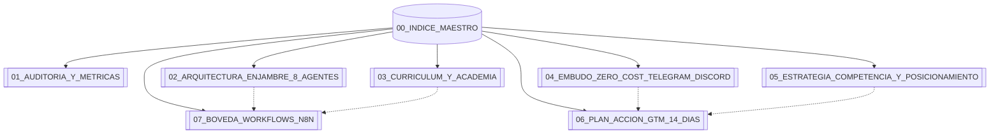

# 🧠 ÍNDICE MAESTRO DE LA BÓVEDA (OBSIDIAN MOC)
> **Proyecto:** Laboratorio de Asistentes de IA & Academia AAA  
> **Repositorio GitHub:** [ponchogf88/laboratorio-asistente-ia](https://github.com/ponchogf88/laboratorio-asistente-ia)  
> **Stack Operativo:** n8n Self-Hosted + Telegram Bot API + Google Gemini 2.5 (2M Context) + Discord + FastAPI ($0 Cost)

---

## 🗺️ MAPA DE CONTENIDOS Y NAVEGACIÓN

---

## 📂 ESTRUCTURA PRINCIPAL DE LA BÓVEDA

### 1. 🔍 Diagnóstico, Auditoría y Dictamen Metodológico
* [[01_AUDITORIA_Y_METRICAS]]: Auditoría exhaustiva componente por componente, porcentaje de completitud (91.5%), análisis de brechas (gap analysis) y mapa de archivos.

### 2. 🤖 Enjambre de Agentes Autónomos (Enterprise Swarm)
* [[02_ARQUITECTURA_ENJAMBRE_8_AGENTES]]: Matriz completa de los 8 agentes de IA, motores cognitivos (Gemini 2.5 Flash / Pro con 1M y 2M tokens), System Prompts de producción y enrutamiento de webhooks.

### 3. 🎓 Programa Académico & Contenidos Masterclass
* [[03_CURRICULUM_Y_ACADEMIA]]: Temario maestro de 5 módulos (30 días), fichas técnicas, workbooks descargables por sesión y plantillas de constancia digital.

### 4. 🧲 Embudo de Ventas $0 Bootstrap
* [[04_EMBUDO_ZERO_COST_TELEGRAM_DISCORD]]: Arquitectura del funnel orgánico (Tráfico ➔ Bot SDR Telegram ➔ Servidor Discord ➔ Cohorte Beta / Consultoría High-Ticket).

### 5. 🥊 Análisis de Competencia y Posicionamiento de Monopolio
* [[05_ESTRATEGIA_COMPETENCIA_Y_POSICIONAMIENTO]]: Comparativa directa con referentes del mercado (Liam Ottley, Álvaro Sáez, Conquer Blocks, Founderz), ventajas competitivas y pricing defensivo.

### 6. 🚀 Plan de Acción Agresivo (GTM Sprint 14 Días)
* [[06_PLAN_ACCION_GTM_14_DIAS]]: Cronograma día a día para lanzamiento orgánico con $0 inversión, prospección B2B y meta de facturación de $3,000 a $7,500 USD en menos de 2 semanas.

### 7. ⚙️ Bóveda de Workflows n8n Listos para Importar
* [[07_BOVEDA_WORKFLOWN_N8N]]: Catálogo de los 6 flujos JSON funcionales (Telegram SDR, Scraper B2B, Soporte RAG pgvector, Creador de Contenido Viral, etc.) con guías de credenciales.

---

## ⚡ ACCESOS RÁPIDOS Y ATRIBUTOS
* **Portal Interactivo Local:** `index.html` (Abrir en cualquier navegador)
* **Script de Sincronización:** `subir-a-github.bat` (Git commit & push con 1 clic)
* **Lanzador de n8n Local:** `iniciar-n8n.bat`
* **Licencia & Propiedad:** 100% Código Abierto / Propiedad de ponchogf88
