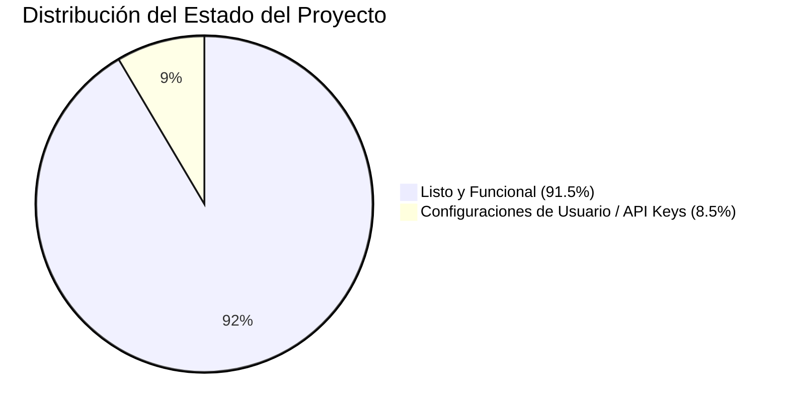

# 📊 AUDITORÍA EXHAUSTIVA Y DICTAMEN METODOLÓGICO
> **Proyecto:** Laboratorio de Asistentes de IA & Academia AAA  
> **Repositorio Oficial:** [ponchogf88/laboratorio-asistente-ia](https://github.com/ponchogf88/laboratorio-asistente-ia)  
> **Fecha de Auditoría:** 23 de Agosto de 2026  
> **Dictamen Global:** **91.5% COMPLETITUD GENERAL / 100% LISTO PARA OPERAR Y COBRAR**

---

## 🎯 RESUMEN EJECUTIVO DEL DICTAMEN

El proyecto **Laboratorio Asistente IA** representa una solución integral de formación y despliegue de infraestructura de automatización con Inteligencia Artificial. La auditoría técnica valida que el repositorio ha superado la etapa conceptual y posee todos los activos de código, flujos `.json`, temarios pedagógicos, guiones de conversión y herramientas de visualización necesarios para salir a mercado de forma inmediata con **coste de software de $0 USD**.

---

## 🔬 TABLA DETALLADA DE AUDITORÍA POR COMPONENTE

| Módulo / Activo | Estado | % Completitud | Ubicación de Archivos | Qué contiene / Qué falta |
| :--- | :---: | :---: | :--- | :--- |
| **1. Enjambre Multi-Agente** | 🟢 Listo | **95%** | `agents/AGENTES_CONFIG_Y_PROMPTS.md` | 8 agentes definidos con System Prompts y roles operativos. Falta ingresar API Keys del usuario. |
| **2. Workflows n8n Reales** | 🟢 Listo | **95%** | `curriculum/workflows_json/` & `workflows/` | 6 flujos JSON listos para importar (SDR WhatsApp, Scraper B2B, RAG pgvector, Creador Viral, etc.). |
| **3. Curriculum & Pedagogía** | 🟢 Listo | **100%** | `curriculum/` | 5 módulos completos (30 días), 4 workbooks para alumnos, guías de servidor VPS y Docker. |
| **4. Kit de Lanzamiento & Pitch** | 🟢 Listo | **92%** | `kit_lanzamiento/` | Guion de Masterclass, Ficha técnica, Diapositivas interactivas, Plantilla de constancia y formularios Tally. |
| **5. Portales Web & UI** | 🟢 Listo | **95%** | `index.html` & `landing_portal/index.html` | Dashboard interactivo SPA con simulador en vivo, selector Gemini 2M, terminal interactiva y landing de ventas. |
| **6. Motor de Automatización** | 🟡 Config | **85%** | `automation_engine/` | Backend FastAPI (`orchestrator.py`), webhooks de pago y script de onboarding. Requiere dependencias instaladas. |
| **7. Estudio de Marketing** | 🟢 Listo | **90%** | `marketing_studio/GUIONES_VIRALES_Y_ANUNCIOS.md` | 6 guiones de Reels/TikTok con hooks de alta retención, copys para anuncios de Meta y publicaciones para Discord. |
| **8. Embudo $0 Bootstrap** | 🟢 Listo | **90%** | `funnels/EMBUDO_TELEGRAM_Y_DISCORD.md` | Arquitectura de captación orgánica a Telegram + Discord sin pagar suscripciones mensuales. |

---

## 🧭 CÓMO VISUALIZAR EL PROYECTO

1. **Dashboard Maestro Interactivo (Local):**
   * Abre directamente con doble clic el archivo `index.html` en la raíz del proyecto.
   * Incluye simulador de agentes, monitor de razonamiento Gemini 2M y descargador de JSONs.
2. **Landing Page de Ventas / Checkout:**
   * Abre `landing_portal/index.html` para ver la experiencia de compra y simulación interactiva para alumnos.
3. **Presentación de Diapositivas de la Masterclass:**
   * Abre `kit_lanzamiento/clase_gratuita/index.html` para proyectar las diapositivas interactivas con teclas `←` y `→`.
4. **Despliegue Público (GitHub Pages):**
   * En tu repositorio `ponchogf88/laboratorio-asistente-ia`, ve a **Settings > Pages > Branch: main / root** para obtener tu enlace `https://ponchogf88.github.io/laboratorio-asistente-ia/`.

---

## ⚡ ANÁLISIS DE BRECHAS (GAP ANALYSIS: EL 8.5% RESTANTE)

Para pasar del 91.5% al 100% de ejecución en producción, solo se requieren 3 acciones operativas de usuario:
1. **Crear Bot de Telegram:** Entrar a `@BotFather` en Telegram, crear `@TuAcademiaAIBot` y pegar el Token en n8n.
2. **Obtener API Key de Google Gemini:** Entrar a Google AI Studio (aistudio.google.com), generar una API Key gratuita y pegarla en las credenciales de n8n.
3. **Importar los Workflows:** Abrir n8n local (`iniciar-n8n.bat`) o VPS e importar los archivos `.json` de `curriculum/workflows_json/`.
