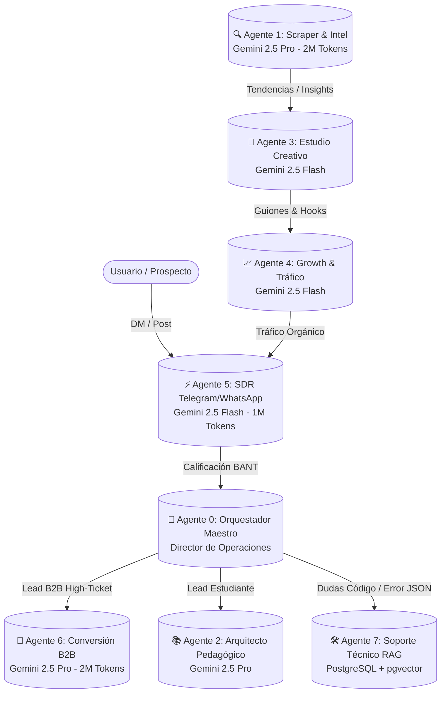

# 🤖 ARQUITECTURA DEL ENJAMBRE MULTI-AGENTE (8 AGENTES)
> **Proyecto:** Laboratorio de Asistentes de IA & Academia AAA  
> **Motor Cognitivo Primario:** Google Gemini 2.5 Flash / Pro (1M - 2M Tokens)  
> **Infraestructura:** n8n Self-Hosted + Telegram Bot API + Discord + FastAPI ($0 Cost)

---

## 🧭 TOPOLOGÍA DEL ENJAMBRE EN ACCIÓN

---

## 📋 MATRIZ ESPECÍFICA DE LOS 8 AGENTES

### 👑 Agente 0: Orquestador Maestro (Director de Operaciones)
* **Motor Cognitivo:** Google Gemini 2.5 Flash | **Contexto:** 1,000,000 tokens
* **Rol:** Enrutamiento central, monitoreo de latencias, sincronización entre base de datos PostgreSQL/Notion y alerta de leads VIP al canal `#leads-vip` de Discord.

### 🔍 Agente 1: Scraper & Market Intelligence
* **Motor Cognitivo:** Google Gemini 2.5 Pro | **Contexto:** 2,000,000 tokens
* **Rol:** Ingesta de grandes volúmenes de transcripciones de videos, hilos de Reddit/X y librerías de anuncios para extraer las 5 tendencias con mayor tracción semanal.

### 📚 Agente 2: Arquitecto Pedagógico y Curriculum
* **Motor Cognitivo:** Google Gemini 2.5 Pro | **Contexto:** 2,000,000 tokens
* **Rol:** Mantenimiento y actualización de los 5 módulos de la academia, control de calidad de los archivos `.json` de n8n y generación de workbooks prácticos.

### 🎨 Agente 3: Estudio Creativo y Copywriting
* **Motor Cognitivo:** Google Gemini 2.5 Flash | **Contexto:** 1,000,000 tokens
* **Rol:** Redacción persuasiva de guiones para Reels/TikTok con estructura: Gancho (0-4s) + Demo n8n (5-25s) + Autoridad (26-38s) + CTA a Telegram (39-50s).

### 📈 Agente 4: Growth & Tráfico
* **Motor Cognitivo:** Google Gemini 2.5 Flash | **Contexto:** 1,000,000 tokens
* **Rol:** Medición de CTR en enlaces de biografía, tasas de conversión del bot a Discord (Meta: > 45%) y optimización continua de ganchos orgánicos.

### ⚡ Agente 5: SDR Conversacional (Telegram Bot & WhatsApp)
* **Motor Cognitivo:** Google Gemini 2.5 Flash (Latencia < 500ms) | **Contexto:** 1,000,000 tokens
* **Rol:** Despacho instantáneo de plantillas JSON ante el comando `/start`, calificación con framework BANT y agendamiento automático en Google Calendar.

### 💼 Agente 6: Conversión & Diagnóstico B2B (High-Ticket)
* **Motor Cognitivo:** Google Gemini 2.5 Pro | **Contexto:** 2,000,000 tokens
* **Rol:** Auditoría previa de empresas interesadas en automatizaciones a medida ($1,500 - $3,000 USD), cálculo de ROI de horas ahorradas y redacción de propuestas de servicio.

### 🛠️ Agente 7: Soporte Técnico y Mentoría RAG
* **Motor Cognitivo:** Google Gemini 2.5 Flash + Supabase / PostgreSQL pgvector
* **Rol:** Resolución automática de dudas de estudiantes en el canal `#dudas-n8n`, validación sintáctica de JSONs y asistencia de debugging 24/7.

---

## 🔗 ENLACES RELACIONADOS
* [[00_INDICE_MAESTRO_VAULT]]: Volver al índice principal.
* [[01_AUDITORIA_Y_METRICAS]]: Ver el estado de implementación de los agentes.
* [[07_BOVEDA_WORKFLOWS_N8N]]: Ver los flujos JSON que ejecutan a los agentes.
