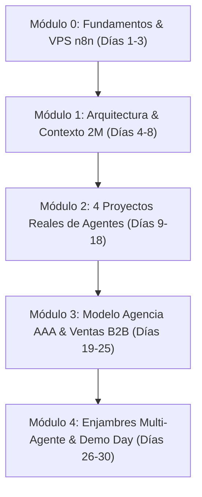

# 🎓 PROGRAMA ACADÉMICO & CURRICULUM MAESTRO (30 DÍAS)
> **Proyecto:** Máster en Agentes de IA y Automatización (AAA)  
> **Enfoque Pedagógico:** Práctica en vivo, código abierto, $0 coste de APIs y despliegue real en servidores propios.

---

## 🗺️ ESTRUCTURA MODULAR DEL PROGRAMA

---

## 📚 DETALLE DE LOS 5 MÓDULOS DE FORMACIÓN

### 🚀 Módulo 0: Fundamentos y Servidor Propio (Día 1 a 3)
* **Objetivo:** Desplegar n8n en VPS (Hetzner / Docker) y conectar Google Gemini API a coste $0.
* **Lecciones:**
  * Configuración de Docker Compose con SSL automático (Traefik / Nginx).
  * Conexión con Google AI Studio (API Key gratuita de Gemini 2.5 Flash y Pro).
  * Comparativa de latencia y costes vs Zapier / OpenAI.
* **Entregable:** Instancia propia de n8n operativa con ejecuciones ilimitadas.

### 🧠 Módulo 1: Arquitectura de Agentes y Memoria Masiva (Día 4 a 8)
* **Objetivo:** Dominar el patrón Percepción ➔ Razonamiento ➔ Acción y ventanas de 1M-2M tokens.
* **Lecciones:**
  * Uso de Structured JSON Outputs para eliminar alucinaciones.
  * Ingesta de bases de datos y manuales completos sin chunking complejo.
  * Conexión con PostgreSQL + pgvector y Supabase para memoria persistente.

### 🛠️ Módulo 2: 4 Proyectos Reales Listos para Producción (Día 9 a 18)
1. **Agente SDR WhatsApp/Telegram 24/7:** Calificación BANT y agendamiento en Google Calendar.
2. **Agente Scraper & Prospección B2B:** Extracción en frío y personalización de Cold Emails con Gemini 2M.
3. **Agente de Soporte & Comunidad RAG:** Conexión a canales de Discord y resolución de dudas técnicas.
4. **Agente Multimodal Creador de Contenido:** Ingesta de videos/audios y generación de guiones virales.

### 💼 Módulo 3: El Modelo de Agencia de Automatización (AAA) (Día 19 a 25)
* **Objetivo:** Empaquetar y vender soluciones B2B a $1,500 – $3,000 USD por cliente.
* **Lecciones:**
  * Pricing: Setup fee + Retainer mensual de mantenimiento ($300 - $800/mes).
  * Los 5 nichos más rentables (Clínicas, Inmobiliarias, Despachos, Agencias, E-commerce).
  * Bóveda legal: Contratos de prestación de servicios y acuerdos de confidencialidad (NDA).

### 🌐 Módulo 4: Enjambres Multi-Agente & Demo Day (Día 26 a 30)
* **Objetivo:** Orquestar múltiples agentes en paralelo y presentar el proyecto final.
* **Lecciones:**
  * Enrutamiento dinámico con Agente Orquestador.
  * Monitoreo de latencia y fallbacks automáticos.
  * **Masterclass Especial:** *"Organiza toda tu semana en 15 minutos con la CLI"* (Disparo de tareas y agendas de jalón por terminal).
  * Demo Day: Presentación de proyectos y entrega de Constancia Digital por GC2 Legal Solutions.

---

## 🔗 ENLACES RELACIONADOS
* [[00_INDICE_MAESTRO_VAULT]]: Índice principal.
* [[07_BOVEDA_WORKFLOWS_N8N]]: Workflows JSON correspondientes a cada módulo.
