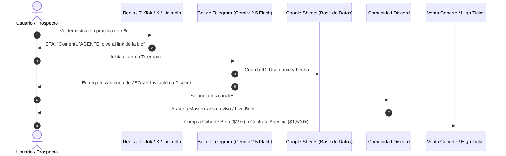

# 🧲 EMBUDO DE ADQUISICIÓN $0 BOOTSTRAP (TELEGRAM + DISCORD)
> **Proyecto:** Laboratorio Asistente IA  
> **Coste de Software:** **$0 USD / mes** (Sustituye suscripciones de $250+/mes de ManyChat y Skool).

---

## 🔄 DIAGRAMA DE FLUJO DEL EMBUDO ORGÁNICO

---

## 🛠️ COMPONENTES DEL STACK $0

| Componente | Herramienta Gratuita | Función Principal | Coste Anterior Reemplazado |
| :--- | :--- | :--- | :--- |
| **Punto de Entrada** | Telegram Bot API | Recepción de leads, entrega de archivos y calificación BANT. | ManyChat Pro ($45 - $125/mes) |
| **Comunidad & Nurturing** | Servidor de Discord | Canales de soporte, eventos en vivo en Discord Stage y networking. | Skool ($99/mes) |
| **Motor Cognitivo** | Google Gemini 2.5 Flash | Razonamiento en tiempo real con 1M tokens de contexto a coste $0. | OpenAI GPT-4o API ($50 - $200/mes) |
| **Base de Datos** | Google Sheets / PostgreSQL | Almacenamiento seguro de prospectos, scores y correos. | Airtable Pro ($24/mes) |
| **Orquestador** | n8n Self-Hosted / Local | Ejecución de flujos y webhooks ilimitados. | Zapier / Make ($50 - $299/mes) |

---

## 📈 MÉTRICAS Y OBJETIVOS DE CONVERSIÓN
* **Tasa de Clics en Bio:** > 3.5% sobre impresiones de contenido.
* **Tasa de Conversión a Miembro de Discord:** > 40% de quienes interactúan con el bot de Telegram.
* **Tasa de Asistencia a Sesiones en Vivo:** > 30% de la comunidad de Discord.
* **Conversión a Cohorte:** 10% - 18% de los asistentes en vivo.

---

## 🔗 ENLACES RELACIONADOS
* [[00_INDICE_MAESTRO_VAULT]]: Índice principal.
* [[06_PLAN_ACCION_GTM_14_DIAS]]: Ejecución del embudo en el sprint de 14 días.
