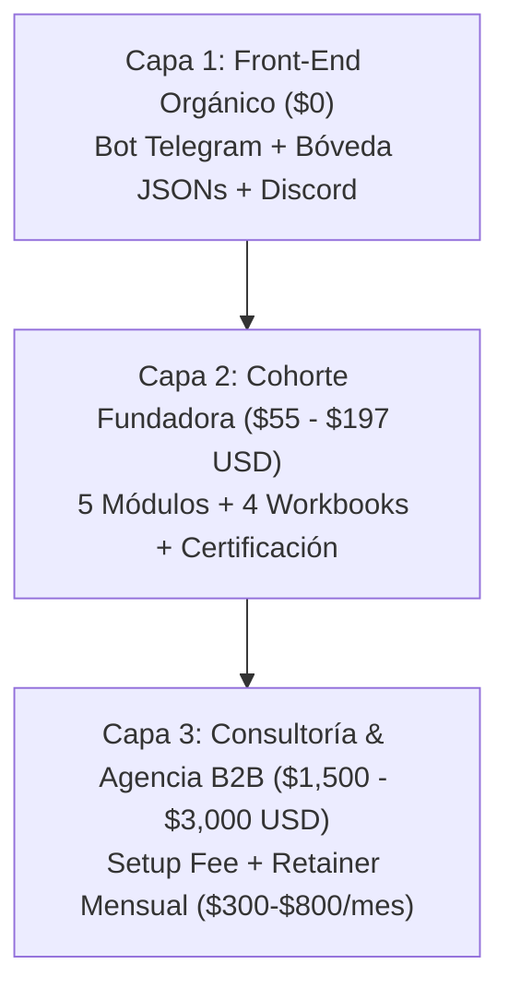

# 🥊 ANÁLISIS DE COMPETENCIA Y POSICIONAMIENTO DE MONOPOLIO
> **Proyecto:** Laboratorio Asistente IA  
> **Objetivo:** Posicionar la oferta como el estándar indiscutible de Agentes IA con coste operativo $0.

---

## 📊 MATRIZ COMPARATIVA DE COMPETIDORES

| Criterio | Academias Tradicionales (Founderz / Conquer) | Creadores Make / Zapier (Álvaro Sáez, etc.) | High-Ticket Anglo (Liam Ottley AAA) | **NUESTRO LABORATORIO IA (ponchogf88)** |
| :--- | :--- | :--- | :--- | :--- |
| **Precio de Entrada** | $1,200 - $3,500 EUR | $500 - $1,500 EUR | $1,500 - $5,000 USD | **$1,000 MXN (~$55 USD) Beta / $197 USD Regular** |
| **Coste Mensual Herramientas** | $100 - $300/mes (APIs caras) | $50 - $200/mes (Make/Zapier) | $150 - $400/mes | **$0 USD (n8n + Gemini 2.5 + Telegram + Discord)** |
| **Enfoque Práctico** | Muy teórico / Diapositivas | Automatización simple / No-code | Enfocado en ventas B2B | **Agentes Autónomos Reales + Bóveda de JSONs + Agencia B2B** |
| **Ventana de Contexto** | 8k - 32k tokens | 16k - 64k tokens | 128k tokens (OpenAI) | **1,000,000 a 2,000,000 Tokens (Google Gemini)** |
| **Bóveda Comercial & Legal** | ❌ No incluye | ⚠️ Básica | ✅ Completa | **✅ Contratos B2B + NDAs + Constancia GC2 Legal Solutions** |

---

## 💎 NUESTRA VENTAJA INJUSTA (MOAT)

1. **Anti-Suscripciones (Zero OPEX):** Al eliminar Zapier, Make y OpenAI de pago, nuestros alumnos y clientes ahorran entre $1,200 y $4,000 USD al año en software.
2. **Contexto Extremo (Gemini 2M):** Podemos alimentar libros enteros, catálogos de productos y bases de código en un solo prompt sin lidiar con arquitecturas RAG complejas que fallan.
3. **Validación Legal:** Acreditación y constancia privada con evidencia respaldada por **GC2 Legal Solutions**, generando confianza inmediata en empresas B2B.

---

## 💰 MODELO DE MONETIZACIÓN TRI-CAPA (CASHFLOW ENGINE)

---

## 🔗 ENLACES RELACIONADOS
* [[00_INDICE_MAESTRO_VAULT]]: Índice principal.
* [[06_PLAN_ACCION_GTM_14_DIAS]]: Aplicación comercial de esta estrategia.
