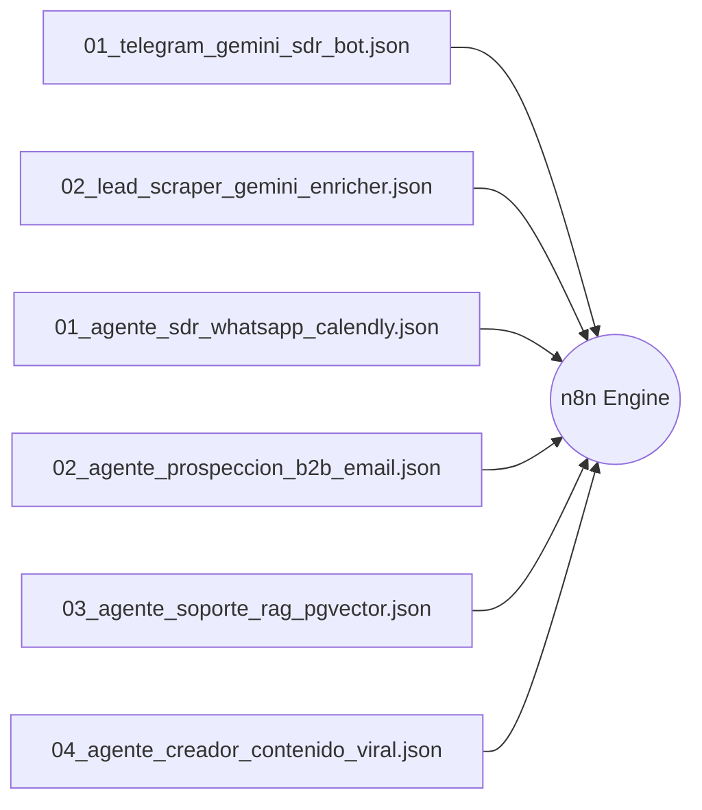

# ⚙️ BÓVEDA DE WORKFLOWS N8N LISTOS PARA PRODUCCIÓN
> **Proyecto:** Laboratorio Asistente IA  
> **Archivos Ubicados en:** `curriculum/workflows_json/` y `workflows/`

---

## 📦 CATÁLOGO DE FLUJOS DISPONIBLES

---

## 🛠️ DESCRIPCIÓN TÉCNICA DE CADA WORKFLOW

### 1. `01_telegram_gemini_sdr_bot.json` (Bot SDR Telegram + Gemini 2.5 Flash)
* **Triggers:** Webhook de Telegram (`/start` o mensaje entrante).
* **Nodos:** Telegram Trigger ➔ Gemini 2.5 Flash Chat Model ➔ Structured Output Parser (BANT) ➔ Google Sheets Append ➔ Telegram Send Message.
* **Ubicación:** `workflows/01_telegram_gemini_sdr_bot.json`.

### 2. `02_lead_scraper_gemini_enricher.json` (Scraper B2B + Cold Email con Gemini Pro)
* **Triggers:** Webhook manual o Cron semanal.
* **Nodos:** HTTP Request (Scraping Web / Google Maps) ➔ Gemini 2.5 Pro (2M Tokens Context) ➔ Parser de Fricciones Operativas ➔ Generador de Cold Email ➔ Gmail Send / Airtable.
* **Ubicación:** `workflows/02_lead_scraper_gemini_enricher.json`.

### 3. `01_agente_sdr_whatsapp_calendly.json` (Agente SDR WhatsApp + Calendly)
* **Triggers:** WhatsApp Cloud API Webhook.
* **Nodos:** WhatsApp Receiver ➔ Gemini 2.5 Flash ➔ Calificación de Presupuesto ➔ Creación de Evento en Calendly / Google Calendar ➔ WhatsApp Confirmation.
* **Ubicación:** `curriculum/workflows_json/01_agente_sdr_whatsapp_calendly.json`.

### 4. `02_agente_prospeccion_b2b_email.json` (Prospección Outbound B2B)
* **Triggers:** Ingesta de CSV de prospectos.
* **Nodos:** CSV Ingest ➔ Extracción de Dominio ➔ Gemini Web Analyzer ➔ Cold Email con Hook Personalizado ➔ Encolado en Smartlead/Instantly.
* **Ubicación:** `curriculum/workflows_json/02_agente_prospeccion_b2b_email.json`.

### 5. `03_agente_soporte_rag_pgvector.json` (Soporte RAG con Memoria Vectorial)
* **Triggers:** Webhook de Discord / Telegram `#dudas-n8n`.
* **Nodos:** Text Splitter ➔ Google Embeddings ➔ PostgreSQL pgvector Similarity Search ➔ Gemini 2.5 Pro Synthesizer ➔ Respuesta con Referencia a la Documentación.
* **Ubicación:** `curriculum/workflows_json/03_agente_soporte_rag_pgvector.json`.

### 6. `04_agente_creador_contenido_viral.json` (Fábrica de Contenido Multimodal)
* **Triggers:** Link de YouTube o archivo de audio cargado.
* **Nodos:** Transcripción Whisper/Gemini Audio ➔ Gemini 2.5 Flash ➔ 1 Guion de Reel + 1 Carrusel de Instagram + 1 Hilo de X + 1 Post para Discord.
* **Ubicación:** `curriculum/workflows_json/04_agente_creador_contenido_viral.json`.

---

## 🚀 CÓMO INSTALAR EN 3 PASOS
1. Abre tu interfaz de n8n (`http://localhost:5678` o tu VPS).
2. Haz clic en **Workflows > Import from File**.
3. Selecciona cualquiera de los archivos `.json` mencionados y asigna tus credenciales de Google AI Studio y Telegram.
